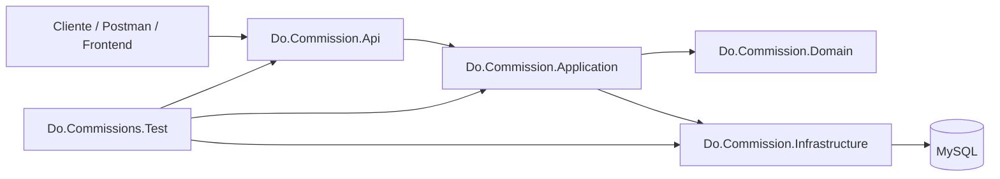
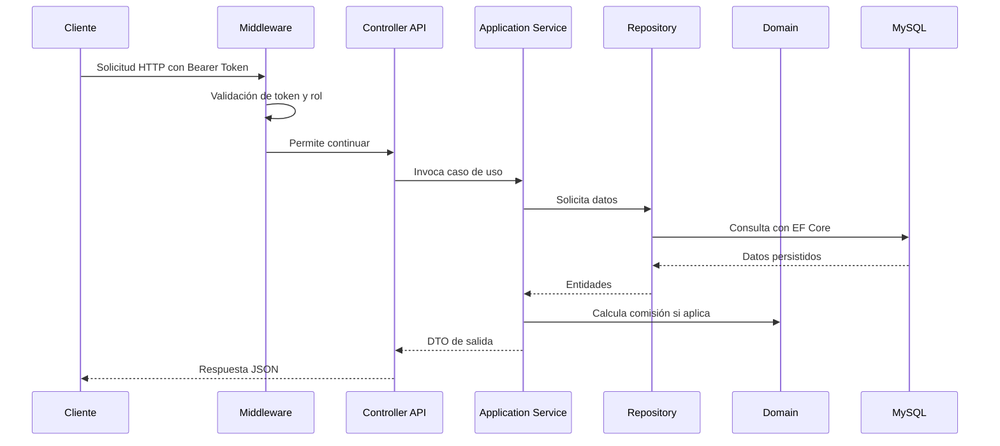
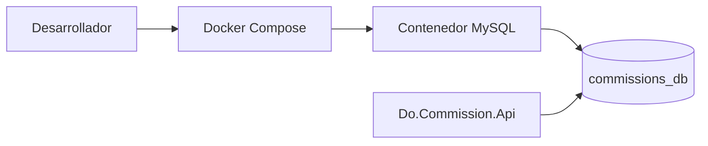
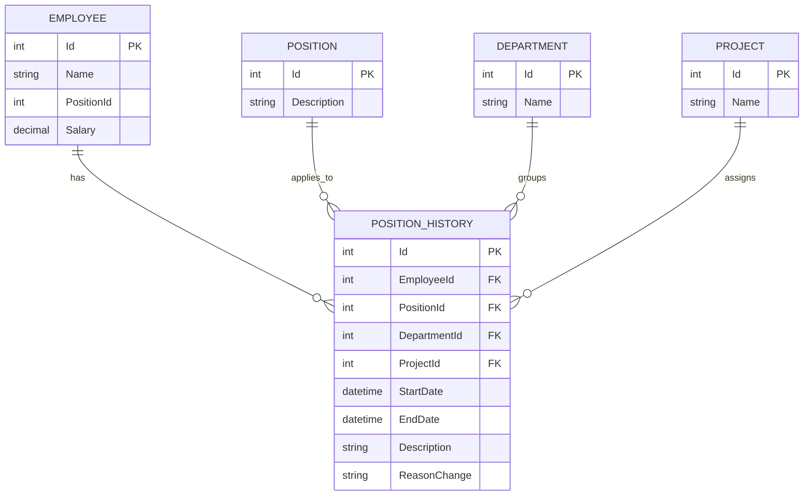
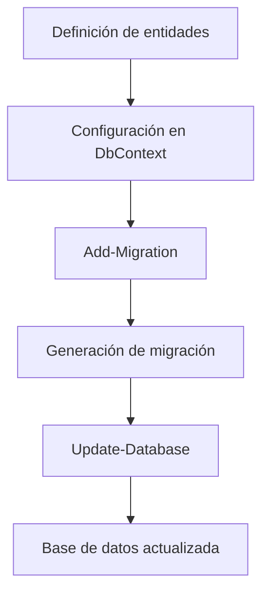
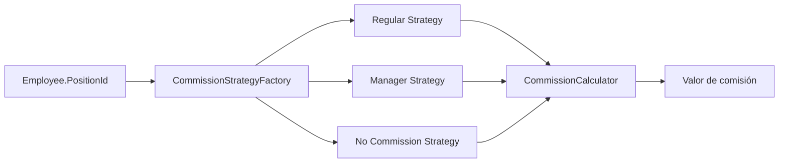
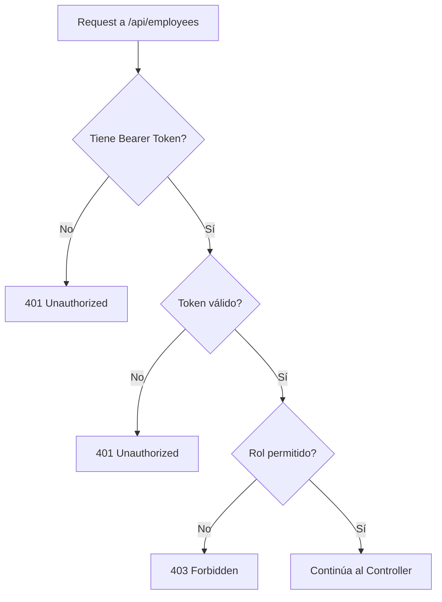
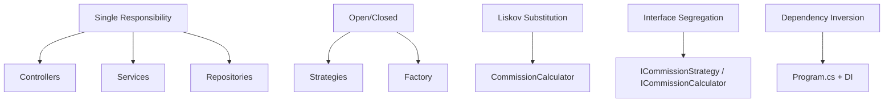

# Documentación funcional y técnica del proyecto `Do.Commission`

## Enfoque

Este documento se redacta con enfoque de análisis funcional y técnico. Su objetivo es explicar, de forma clara y profesional, 
cómo está organizado el sistema, cómo se modela la información, cómo se construye la base de datos con enfoque `Code First`, 
y cómo se exponen los procesos principales de autenticación, consulta de empleados, historial laboral y liquidación de comisiones.

---

## 1. Objetivo del proyecto

`Do.Commission` es una API construida en `ASP.NET Core` cuyo propósito es gestionar empleados y calcular liquidaciones de comisión 
de acuerdo con:

- el cargo actual del empleado,
- el rol de acceso del usuario autenticado,
- y el historial de movimientos del empleado dentro de la empresa.

El sistema permite:

- registrar y autenticar usuarios,
- proteger endpoints según roles,
- consultar empleados y su historial,
- identificar movimientos por departamento y proyecto,
- y calcular comisiones usando reglas de negocio desacopladas.

---

## 2. Arquitectura de la solución

La solución está organizada por capas para separar responsabilidades y facilitar mantenimiento, pruebas y evolución funcional.

### Proyectos principales

- `Do.Commission.Api`
  - Expone los endpoints HTTP.
  - Gestiona autenticación, autorización y middleware.

- `Do.Commission.Application`
  - Orquesta los casos de uso.
  - Convierte entidades de dominio e infraestructura en DTOs de salida.

- `Do.Commission.Domain`
  - Contiene la lógica de negocio pura para cálculo de comisiones.
  - Implementa patrones `Strategy` y `Factory`.

- `Do.Commission.Infrastructure`
  - Acceso a datos con `EF Core`.
  - Modelos, `DbContext`, repositorios y migraciones.

- `Do.Commissions.Test`
  - Pruebas unitarias para controladores y middleware.

### Diagrama de arquitectura



### Flujo general de una solicitud



---

## 3. Referencia técnica de tecnologías utilizadas

La solución fue construida sobre una base tecnológica alineada con desarrollo moderno en `Microsoft .NET` y persistencia relacional en `MySQL`.

### Stack principal

- `ASP.NET Core` para la exposición de la API REST.
- `.NET 10` como framework de ejecución de la solución.
- `Entity Framework Core` como ORM para acceso a datos.
- `Pomelo.EntityFrameworkCore.MySql` como proveedor de EF Core para `MySQL`.
- `Mapster` para el mapeo entre entidades y DTOs.
- `JWT` para autenticación basada en tokens.
- `xUnit` para pruebas unitarias.
- `Docker Compose` para levantar infraestructura local de base de datos.

### ¿Por qué `MySQL`?

Se utiliza `MySQL` como motor de base de datos por ser una tecnología ampliamente adoptada, estable y apropiada para escenarios transaccionales 
como:

- gestión de empleados,
- trazabilidad de movimientos,
- almacenamiento de historial,
- y consultas estructuradas sobre relaciones entre entidades.

Además, `EF Core` junto con el proveedor `Pomelo` permite trabajar sobre `MySQL` manteniendo el enfoque `Code First` y las migraciones 
controladas desde código.

### Infraestructura local con `Docker Compose`

Para simplificar la puesta en marcha del entorno local, la base de datos puede ejecutarse mediante `Docker Compose`.

La configuración utilizada es la siguiente:

```yaml
services:
  mysql:
    build: 
      context: .
      dockerfile: Dockerfile_mysql
    container_name: commissions
    restart: always
    ports:
      - "3306:3306"
    environment:
      MYSQL_ROOT_PASSWORD: root
      MYSQL_DATABASE: commissions_db
      MYSQL_USER: test
      MYSQL_PASSWORD: test_123456
      MYSQL_ROOT_HOST: '%'
    volumes:
      - ./schemas:/var/lib/mysql:rw
    networks:
      mysql_network: 
        aliases:
          - mysql_host 
volumes:
  mysql_data:
networks:
  mysql_network: 
    name: mysql_network
    driver: bridge
```

### Lectura funcional de la configuración

- se crea un servicio llamado `mysql`,
- el contenedor se expone en el puerto `3306`,
- la base de datos inicial se llama `commissions_db`,
- se define un usuario de aplicación y un usuario root,
- se persiste información mediante volumen montado,
- y se define una red dedicada para comunicación interna.

### Relación con la configuración de la API

La API espera una conexión a `MySQL` a través de la cadena configurada en `appsettings.json`. Esto permite:

- levantar infraestructura local con contenedor,
- ejecutar migraciones,
- y probar la solución de extremo a extremo sin depender de una instalación manual del motor de base de datos.

### Vista de infraestructura



---

## 4. Modelo de datos y distribución de entidades

El modelo fue organizado para representar tanto la información principal del empleado como su historial de movimientos dentro de la empresa.

### Entidades principales

- `Employee`
  - Representa al empleado.
  - Incluye identificador, nombre, cargo actual y salario.

- `Position`
  - Representa el cargo del empleado.

- `PositionHistory`
  - Registra los movimientos históricos del empleado.
  - Es la entidad clave para entender cambios de cargo, departamento y proyecto.

- `Department`
  - Representa el departamento al que perteneció el empleado en un movimiento histórico.

- `Project`
  - Representa el proyecto asociado a un movimiento del empleado.

### Relación funcional del modelo

La tabla más importante para el análisis histórico es `PositionHistory`, porque conecta:

- el empleado,
- el cargo que tenía en ese momento,
- el departamento,
- el proyecto,
- la fecha de inicio,
- la fecha de fin,
- la descripción del cambio,
- y el motivo del movimiento.

### Diagrama del modelo



---

## 5. Enfoque `Code First` con EF Core

La solución usa `Entity Framework Core` con enfoque `Code First`.

Esto significa que:

1. primero se definen las clases del modelo en código,
2. luego `EF Core` interpreta estas clases,
3. después se generan migraciones,
4. y finalmente esas migraciones construyen o actualizan la base de datos.

### Ventajas de esta decisión

- el modelo de datos queda versionado junto con el código,
- los cambios estructurales son trazables,
- la base de datos evoluciona con control,
- y el equipo puede revisar la intención funcional desde las entidades.

### Flujo de construcción de base de datos



### Elementos que soportan el `Code First`

- entidades en `Do.Commission.Infrastructure/Model`
- contexto en `Do.Commission.Infrastructure/MysqlDbContext.cs`
- migraciones en `Do.Commission.Infrastructure/Migrations`

---

## 6. Cálculo de comisiones: decisión de diseño

La liquidación de comisiones se resuelve en la capa de dominio usando dos patrones:

- `Strategy`
- `Factory`

### ¿Por qué se usó `Strategy`?

Porque las reglas de comisión pueden variar según el cargo del empleado. En lugar de concentrar todas las reglas en un `if` o `switch`, cada regla vive en una clase independiente.

Ejemplos actuales:

- `PercentageCommissionRegularStrategy`
- `PercentageCommissionManagersStrategy`
- `NoCommissionStrategy`

Esto hace que la solución sea:

- más clara,
- más extensible,
- más fácil de probar,
- y menos acoplada.

### ¿Por qué se usó `Factory`?

Porque además de calcular, había que decidir qué estrategia aplicar según el cargo del empleado.

`CommissionStrategyFactory` centraliza esa decisión. Así:

- `CommissionCalculator` no necesita conocer detalles de selección,
- las reglas de mapeo cargo → estrategia viven en un solo lugar,
- y agregar nuevos cargos no obliga a reescribir la lógica completa.

### Diagrama de cálculo



---

## 7. Seguridad: autenticación, autorización y middleware

La API implementa seguridad con `JWT` y control por roles.

### Roles definidos

- `Administrador`
  - puede consultar, crear, actualizar y eliminar empleados.

- `Usuario`
  - puede consultar información, pero no modificarla.

### Autenticación

Se realiza a través de `AuthController`:

- `register`: registra un usuario en memoria y devuelve token.
- `login`: valida credenciales y devuelve token.

### Middleware personalizado

El middleware intercepta solicitudes a `/api/employees` para:

- validar que exista un token `Bearer`,
- validar que el token no esté expirado ni alterado,
- resolver el usuario autenticado,
- validar si el rol puede ejecutar la acción,
- validar identificadores numéricos en consultas por `id`.

### Flujo de seguridad



---

## 8. Endpoints principales

## 8.1 Autenticación

### `POST /api/auth/register`
Registra un usuario nuevo y devuelve un token JWT.

**Body esperado**

```json
{
  "userName": "admin1",
  "password": "123456",
  "role": "Administrador"
}
```

### `POST /api/auth/login`
Autentica un usuario existente y devuelve un token JWT.

**Body esperado**

```json
{
  "userName": "admin1",
  "password": "123456"
}
```

---

## 8.2 Empleados

### `GET /api/employees`
Obtiene todos los empleados, incluyendo su historial cuando exista información relacionada.

### `GET /api/employees/{id}`
Obtiene un empleado por identificador, incluyendo `position_history`.

### `POST /api/employees`
Crea un nuevo empleado.

### `PUT /api/employees/{id}`
Actualiza un empleado existente.

### `DELETE /api/employees/{id}`
Elimina un empleado por identificador.

---

## 8.3 Historial por departamento y proyecto

### `GET /api/employees/departments/{departmentId}/with-projects`
Obtiene el historial de movimientos de empleados pertenecientes a un departamento específico y que además tengan al menos un proyecto asociado.

Este endpoint devuelve `EmployeePositionHistoryDto`, lo que lo hace útil para análisis histórico y trazabilidad interna.

---

## 9. Rol del historial en el negocio

El historial no es un dato accesorio. Es parte central de la lógica del sistema.

Permite responder preguntas como:

- ¿En qué departamento ha estado el empleado?
- ¿En qué proyecto participó?
- ¿Desde cuándo y hasta cuándo estuvo en un cargo?
- ¿Por qué cambió de posición?
- ¿Qué trazabilidad existe sobre su movimiento en la organización?

Desde la perspectiva del negocio, esto es importante porque la liquidación de comisiones no solo depende del empleado como registro actual, sino del contexto laboral y del movimiento histórico que puede justificar análisis, seguimiento o futuras reglas más avanzadas.

---

## 10. DTOs principales expuestos por la API

### `EmployeeDto`
Representa el empleado en respuestas generales.

Incluye:

- documento (`Id`)
- nombre
- cargo actual
- salario
- comisión
- historial (`position_history`)

### `EmployeePositionHistoryDto`
Representa un movimiento histórico del empleado.

Incluye:

- empleado
- cargo
- departamento
- proyecto
- fechas
- descripción
- motivo del cambio

---

## 11. Características SOLID identificables en el código

Aunque la solución puede seguir evolucionando, ya presenta varias decisiones alineadas con principios `SOLID`.

### `S` - Single Responsibility Principle

Cada capa y cada clase principal tienen una responsabilidad claramente identificable.

Ejemplos:

- `EmployeesController` expone endpoints HTTP.
- `EmployeesService` orquesta casos de uso.
- `EmployeeRepository` accede a base de datos.
- `CommissionCalculator` coordina el cálculo.
- cada estrategia encapsula una regla puntual de comisión.

### `O` - Open/Closed Principle

La lógica de comisiones está abierta a extensión pero cerrada a modificación directa.

Ejemplo:

- para agregar una nueva regla de comisión, se puede crear una nueva implementación de `ICommissionStrategy` y registrarla en el factory 
  sin alterar el resto del flujo.

### `L` - Liskov Substitution Principle

Las implementaciones concretas de `ICommissionStrategy` pueden reemplazarse entre sí sin romper el contrato esperado por `CommissionCalculator`.

### `I` - Interface Segregation Principle

Las interfaces existentes mantienen contratos específicos y simples.

Ejemplos:

- `ICommissionStrategy`
- `ICommissionCalculator`

Ambas exponen solo lo necesario para su responsabilidad.

### `D` - Dependency Inversion Principle

La solución utiliza inyección de dependencias en varias partes de la aplicación.

Ejemplos:

- controladores dependen de servicios,
- servicios dependen de repositorios y mapeadores,
- la composición de dependencias se realiza en `Program.cs`.

Esto mejora mantenibilidad, pruebas y desacoplamiento entre capas.

### Vista resumida de principios en la solución



---

## 12. Pruebas unitarias

La solución cuenta con pruebas unitarias en el proyecto `Do.Commissions.Test`.

### Cobertura actual

- `EmployeesControllerTests`
  - consultas generales
  - consulta por id
  - creación
  - actualización
  - eliminación
  - validación de historial en respuestas

- `AuthControllerTests`
  - registro
  - login
  - validación de errores esperados

- `MiddlewareTests`
  - token faltante
  - token inválido
  - validación de rol
  - validación de rutas protegidas
  - validación de identificadores

- `DepartmentEmployeesControllerTests`
  - filtrado por departamento
  - validación de historial con proyecto
  - escenarios sin resultados

### Valor de las pruebas

Las pruebas no solo validan que la API responda correctamente. También garantizan que:

- el historial se cargue cuando debe cargarse,
- los roles se respeten,
- la autenticación funcione,
- y los cambios futuros no rompan el comportamiento esperado.

---

## 13. Decisiones clave del diseño

### Separación por capas
Permite que cada proyecto tenga una responsabilidad clara.

### `Code First`
Mantiene el modelo y la base de datos alineados con el código.

### `Strategy + Factory`
Hace flexible la lógica de comisiones.

### DTOs específicos
Evitan exponer directamente entidades persistidas y permiten adaptar la salida según la necesidad funcional.

### Middleware personalizado
Permite validar reglas de seguridad previas al ingreso al controlador de empleados.

---

## 14. Resumen ejecutivo

La solución `Do.Commission` fue estructurada para resolver un problema concreto de negocio: administrar empleados y calcular comisiones de forma segura, trazable y extensible.

Su diseño permite:

- evolucionar reglas de comisión,
- ampliar historial laboral,
- proteger información por rol,
- mantener trazabilidad sobre movimientos del empleado,
- y sostener el crecimiento del sistema con una base técnica ordenada.

Desde una perspectiva de análisis, la arquitectura actual es consistente con un sistema que necesita combinar:

- operación diaria,
- reglas de negocio,
- control de acceso,
- y seguimiento histórico.

---

## 15. Referencias internas sugeridas

Para profundizar en el código:

- `Do.Commission.Api/Controllers`
- `Do.Commission.Api/Auth`
- `Do.Commission.Api/Middleware`
- `Do.Commission.Application/EmployeesService.cs`
- `Do.Commission.Application/Dtos`
- `Do.Commission.Domain/Commission`
- `Do.Commission.Domain/Strategy`
- `Do.Commission.Infrastructure/Model`
- `Do.Commission.Infrastructure/EmployeeRepository.cs`
- `Do.Commissions.Test`
